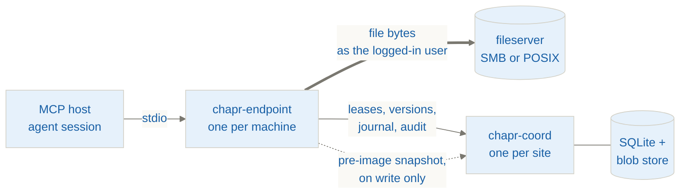

# Chaperone

[](https://github.com/Korsdal/Chaperone/actions/workflows/ci.yml)
[](https://github.com/Korsdal/Chaperone/releases)
[](LICENSE)
[](CONTRIBUTING.md#getting-the-tree-green)

**Filesystem coordination for concurrent AI agent sessions working against one shared fileserver.**

The problem it solves is **lost updates**: two agent sessions doing read-modify-write on the same
file, where the second write silently discards the first. Alongside that, Chaperone makes every
agent-initiated change **attributable** (stamped with the AD principal that caused it) and
**recoverable** (content-addressed history, restore-to-copy).

The workload is read-heavy by design — agents read large materials (PDFs, tenders, proposals) and
write rarely, into smaller derived artifacts.

> [!NOTE]
> Chaperone is a collaboration/sync engine that values security and traceability — **not a security
> tool**. The audit trail proves a user is responsible for their agents (accountability), not
> court-grade non-repudiation.

## How it works

Two deployables, and **two channels that never cross**. File bytes go endpoint → fileserver
directly, under the user's own token; only metadata goes to the coordinator. The 200 MB PDF a model
reads never flows through coord.



| | |
| --- | --- |
| **`chapr-endpoint`** | One per user machine, a stdio child of an MCP host. Owns the exclusive-open write path, the CAS check, the in-place write, the lease-renewal thread, and the read state machine. |
| **`chapr-coord`** | Exactly one, on-prem beside the fileserver. Owns the lease table, version index, intent journal, history/blob store, conflict registry, audit log, and the change-watcher. Does **no file I/O of its own**. |

The thick edge is the only path file content takes to a model. The dotted edge is the one deliberate
exception to "metadata only": a write sends the bytes it is about to replace to coord, because that
pre-image is what history and crash recovery are made of. It is one-directional and bounded at
256 MiB.

Tool namespace: `chapr.<method>` — `chapr.read`, `chapr.write`, and so on. Ten tools against eleven
coord routes. **[Full architecture →](docs/architecture.md)**

## Install

Every release attaches built binaries, so trying Chaperone does not require a Rust toolchain on a
fileserver.

**[Releases →](https://github.com/Korsdal/Chaperone/releases)**

| Artifact | What it is |
| --- | --- |
| `chapr-coord-<ver>-<os>` | The coordinator. Run it with **no arguments** — the executable *is* the installer, and a bare invocation runs the setup wizard. |
| `chaperone-endpoint-<ver>-<os>.mcpb` | The endpoint as a one-click **Claude Desktop** bundle (Settings → Extensions). |
| `chapr-endpoint-<ver>-<os>` | The same endpoint as a bare binary, for **any other MCP host** — see below. |
| `SHA256SUMS` | `sha256sum -c SHA256SUMS`, or `Get-FileHash` on Windows. |

Each is built for `windows-x86_64`, `linux-x86_64` and `macos-arm64`.

The coordinator's OS and the endpoints' OS are **independent**: an Ubuntu fileserver running coord
with Windows laptops, or a Windows/SMB coord with Linux endpoints, are both ordinary. Take the
coordinator build for the host that runs it, and an endpoint for each client OS.

Releases are built by GitHub Actions from a tag, not from someone's laptop, and are
provenance-attested. **[Full deployment guide →](docs/deployment-guide.md)**

### Any MCP host

The endpoint is a plain **MCP server over stdio** with no vendor-specific surface: `rmcp` (the
official SDK), and every setting is an environment variable. Nothing in the tool descriptions or the
MCP `instructions` names a vendor. So anything that speaks MCP can drive it, and `.mcpb` is Claude
Desktop's install format rather than a requirement.

The binary prints its own registration rather than making you assemble one:

```sh
chapr-endpoint print-config              # list the host keys
chapr-endpoint print-config claude-code  # a `claude mcp add …` one-liner
chapr-endpoint print-config generic      # the portable mcpServers JSON block
```

The config goes to **stdout alone** and advice to stderr, so `print-config generic > .mcp.json`
produces a usable file. It resolves its own absolute path and emits the values already set in the
environment — so run it with `CHAPR_COORD_URL` and `CHAPR_ROOT` set and the output needs no editing.
It never writes to a host's config file: that breaks the moment the host changes its schema, and
silently editing another application's files is not this tool's business.

<details>
<summary>The environment contract, if you would rather write the config by hand</summary>

| Variable | |
| --- | --- |
| `CHAPR_COORD_URL` | Coordinator base URL. Required in practice. |
| `CHAPR_ROOT` | Comma-separated coordinated root(s). Confines the endpoint **and** is announced to the model. Unset means unconfined. |
| `CHAPR_BACKEND` | `smb` \| `posix`. Defaults to SMB on Windows, POSIX elsewhere. |
| `CHAPR_PRINCIPAL` | Override the identity. Normally derived from the OS logon. |
| `CHAPR_MAX_INLINE_BYTES` | Per-read context cap. See [Read limits](docs/architecture.md#read-limits-and-what-a-model-can-write-back). |
| `CHAPR_DIAG_LOG` | Local JSON-lines diagnostics sink. Empty value disables it. |
| `RUST_LOG` | Tracing filter. Logs go to stderr, never the MCP channel. |

The `generic` block is the same `mcpServers` shape Claude Desktop's config file and Claude Code's
`.mcp.json` both use, and it is what most other clients read.

</details>

> [!NOTE]
> **Claude Desktop and Claude Code are the hosts we drive end to end.** Others should work and we
> have no reason to think they don't — but we don't test them, so we don't claim them.

## Failure directions

Every one of these is a deliberate choice of which way to fail, not a fallback that happened.

| Situation | Direction | Why |
| --- | --- | --- |
| Coord unreachable, **write** | **Fail closed** — refuse | Writes are rare; refusing costs a retry, guessing costs data |
| Coord unreachable, **read** | **Degrade open** — serve with `integrity = "unverified"`, version omitted | Reads mutate nothing and are the core capability |
| Torn file (dangling journal) on read | **Recover, then serve** the pre-image | A reader must never see torn bytes |
| CAS conflict | Loser's bytes → `.conflict-{user}-{ts}` sidecar, registered, surfaced on next touch | Never lose either party's bytes; never fake-merge an Office binary |
| Office lock (`~$F`) present | **Refuse the write** | Humans always win. Leases are advisory with respect to Excel |
| Retry storm | Bounded retries, exponential backoff + jitter, per-file budget, terminal "ask the human" state | An LLM will otherwise retry forever |

> [!IMPORTANT]
> **The correctness core is exclusive-open + CAS. Leases are only an optimization.** Correct with
> lock+CAS and no leases; *not* correct with leases and no CAS. Ground truth lives on the share,
> never in coord — every write re-derives the version from the file under the lock. And
> `version = BLAKE3(file_bytes)`, one hash serving as change-detector, history key and audit link.

All six invariants, with reasoning: **[docs/architecture.md →](docs/architecture.md#load-bearing-invariants)**

## Status

The v1 tool surface is complete and live-verified end to end: read · write · create · list · stat ·
delete · move/rename · history · conflicts · resolve_conflict.

**It has run on real customer hardware.** The one thing no development environment could stand in
for is settled: **SMB mandatory locking is honoured by an actual Windows Server 2022 share**, so
invariant 3's foundation is measured rather than assumed. The audit trail and the diagnostics
pipeline both worked on first contact.

Tests and clippy are green on **Windows and Linux** (see the CI badge), with the live smoke suite
passing on the SMB and POSIX backends.

> [!NOTE]
> **macOS is built in CI but has never been run.** It compiles down the same POSIX path as Linux —
> nothing in the endpoint is Linux-specific — but treat those artifacts as compile-verified only.

<details>
<summary>Known remaining work</summary>

- Real **Kerberos/Negotiate** on the control channel — needs a domain to develop against.
- **Mapped drive letters** resolve to UNC via `WNetGetUniversalNameW`, but that path is unconfirmed
  against a real server. The self-test reports it as SKIP rather than pass, which is the point.
- **DFS resolution is not implemented.** It was not needed for the first deployment; a DFS namespace
  would need it before rollout.
- **MCPB signing is broken upstream**, so bundles ship unsigned and Claude Desktop reports every
  bundle as unsigned regardless. Accountability rests on the audit trail.
- **Delivering a large PDF's *content* to a model is unsolved.** The bytes arrive base64, which is
  not analysable — either an `EmbeddedResource` content block or `ReadContent::Ref` needs to become
  real, or PDF reading stays outside the tool surface. See
  [Read limits](docs/architecture.md#read-limits-and-what-a-model-can-write-back).

</details>

### Scope

| | |
| --- | --- |
| **In (v1)** | The tool surface above; leases with renewal and all-or-none ordered sets; intent journal with lazy and proactive recovery; content-addressed history with restore-to-copy; conflict registry; audit log; whole-file dedup; the untrusted-data envelope on reads; SMB and POSIX backends |
| **Deferred** | ACL-aware metadata index (v2), chunked dedup (v2), cell-level xlsx CAS (v2), dashboard push (v2), coord HA (v3), cloud backends |
| **Out of scope** | Cross-file atomic transactions, three-way merge of Office binaries, CRDT or character-level co-editing, multi-server replication |

## Build

```sh
cargo build --workspace
cargo test  --workspace
cargo clippy --workspace --all-targets -- -D warnings
```

Requires **Rust 1.88+**. The Windows builds link the CRT statically
(`.cargo/config.toml`), so the shipped binaries need no Visual C++ redistributable — the dynamic
default stopped a coordinator from starting on a clean Windows Server 2022.

Coord setup and service install:

```sh
chapr-coord                            # no arguments = the setup wizard
chapr-coord setup --non-interactive …  # unattended, for fleet rollout
chapr-coord serve --config coord.toml
```

The coordinator's own executable is the installer: there is no script to run, and a bare invocation
runs the wizard unless a `coord.toml` is present or there is no console to prompt on.

> [!WARNING]
> `addr` (where the socket binds) and `public_url` (what a laptop connects to) are two different
> settings. Conflating them is how an administrator once came to be told to configure
> `http://127.0.0.1:8787` fleet-wide.

See `packaging/coord/` for the config template and service install steps, and `packaging/mcpb/` for
building the endpoint bundle.

## Contributing

Issues and PRs welcome; inbound=outbound, no CLA. Three things about this codebase are not guessable
from the code — the invariants are assertions, the write path is deliberately boring, and version
bumps are human-only.

**[CONTRIBUTING.md →](CONTRIBUTING.md)**

## Security

The endpoint runs as the logged-in user and ACLs are enforced by that token on the direct filesystem
path — there is no impersonation or delegation layer. Every lease, write, restore and history entry
is stamped with the acting AD principal.

Two limitations are documented rather than hidden: `coord.resolve` leaks file *existence* regardless
of ACL, and coord's blob store holds real file content with no ACL check on any route in the v1
`trusted-header` posture. Treat reachability of coord as equivalent to read access to file history.

**[docs/security.md →](docs/security.md)**

## License

[Apache License 2.0](LICENSE). Copyright 2026 SerenIT ApS and Prompted EV — Chaperone is jointly
owned by the two companies, and was open-sourced by agreement of both. See [NOTICE](NOTICE).

The reasoning for going open, in the owners' words: *don't give larger companies a reason to go
build the same tool*, and *if it works, everyone should be able to grab it*.

Apache-2.0 rather than MIT because this ships as binaries into other companies' networks, where it
holds exclusive handles on their files: it carries an explicit patent grant, and its NOTICE
requirement keeps two-company attribution attached to a redistributed build rather than leaving it
in a repo the recipient never sees. `.mcpb` bundles are therefore built with LICENSE and NOTICE
inside them.

Still `publish = false` — Chaperone is two deployables, not a library dependency. Open source and
published-to-crates.io are separate decisions.

---

🤖 Generated with [Claude Code](https://claude.com/claude-code)

Chaperone is built with AI assistance under human review. Architecture decisions are human-owned and
recorded in an engineering logbook kept outside this repo; every commit is human-reviewed before it
lands.
