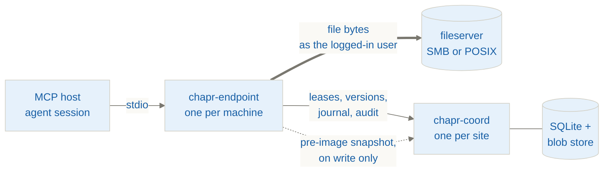

# Chaperone

[](https://github.com/Korsdal/Chaperone/actions/workflows/ci.yml)
[](https://github.com/Korsdal/Chaperone/releases)
[](LICENSE)
[](CONTRIBUTING.md#getting-the-tree-green)

## TL;DR

Two AI agent sessions editing the same file on a shared drive will silently
overwrite each other. Chaperone stops that.

- **What.** An MCP server plus one coordination service, for on-prem fileservers
  (SMB or POSIX).
- **How.** An exclusive file lock and a content-hash compare-and-swap on every
  write. A stale write is refused, never merged.
- **Also.** Every agent-initiated change is attributable (stamped with the AD
  principal) and recoverable (content-addressed history, restore-to-copy).
- **Status.** Pilot running on a customer's on-prem SMB share. Prebuilt binaries
  for Windows, Linux and macOS on the
  [Releases page](https://github.com/Korsdal/Chaperone/releases).

> [!NOTE]
> Chaperone is a collaboration and sync engine that values security and
> traceability. It is **not a security tool**. The audit trail proves a user is
> responsible for their agents (accountability), not court-grade non-repudiation.

## How it works



| | |
| --- | --- |
| **`chapr-endpoint`** | One per user machine, a stdio child of an MCP host. Owns the exclusive-open write path, the CAS check, the in-place write, the lease-renewal thread and the read state machine. |
| **`chapr-coord`** | Exactly one, on-prem beside the fileserver. Owns the lease table, version index, intent journal, history and blob store, conflict registry, audit log and change-watcher. Does **no file I/O of its own**. |

- **Thick edge:** the only path file content takes to a model. A 200 MiB PDF never
  flows through coord.
- **Dotted edge:** the one exception. A write sends coord the bytes it is about to
  replace, because that pre-image is what history and crash recovery are made of.
  One direction, bounded at 256 MiB.

**[Architecture, invariants and failure directions →](docs/architecture.md)**

## Install

Every release attaches built binaries, so trying Chaperone does not require a Rust
toolchain on a fileserver.

**[Releases →](https://github.com/Korsdal/Chaperone/releases)**

| Artifact | Platforms | What it is |
| --- | --- | --- |
| `chapr-coord-<ver>-windows-x86_64.msi` | Windows | The coordinator's installer. Places the binary, registers and starts the service, opens the port. |
| `chapr-coord-<ver>-linux-x86_64` | Linux | The coordinator. Run it with **no arguments**: the executable *is* the installer, and a bare invocation runs the setup wizard. |
| `chaperone-endpoint-<ver>-<os>.mcpb` | all three | The endpoint as a one-click **Claude Desktop** bundle (Settings → Extensions). |
| `chapr-endpoint-<ver>-<os>` | all three | The same endpoint as a bare binary, for any other MCP host. |
| `SHA256SUMS` | — | `sha256sum -c SHA256SUMS`, or `Get-FileHash` on Windows. |

Endpoints build for `windows-x86_64`, `linux-x86_64` and `macos-arm64`. **The
coordinator does not ship for macOS** — a Mac fronting a shared fileserver is a
deployment nobody runs and nothing tests, and an artifact whose only claim is that
it compiled is worse than an absent one.

The coordinator's OS and the endpoints' OS are otherwise **independent**: a Linux
coord with Windows laptops is ordinary, and so is the reverse. Releases are built by
GitHub Actions from a tag, not from someone's laptop, and are provenance-attested.
Nothing is code-signed, so Windows will ask before running the installer.

**[Deployment guide →](docs/deployment-guide.md)**

### Any MCP host

The endpoint is a plain MCP server over stdio with no vendor-specific surface, and it
prints its own registration rather than making you assemble one:

```sh
chapr-endpoint print-config              # list the host keys
chapr-endpoint print-config claude-code  # a `claude mcp add` one-liner
chapr-endpoint print-config generic      # the portable mcpServers JSON block
```

Config goes to **stdout alone** and advice to stderr, so
`print-config generic > .mcp.json` produces a usable file. Run it with
`CHAPR_COORD_URL` and `CHAPR_ROOT` set and the output needs no editing. It never
writes to a host's config file. Full environment contract:
[deployment guide](docs/deployment-guide.md#step-2-endpoints).

> [!NOTE]
> **Claude Desktop and Claude Code are the hosts we drive end to end.** Others should
> work and we have no reason to think they don't, but we don't test them, so we don't
> claim them.

## Status

- **Tool surface complete and live-verified:** read, write, create, mkdir, list,
  stat, delete, move/rename, history, restore, conflicts, resolve_conflict.
- **Proven on real hardware.** SMB mandatory locking is honoured by an actual Windows
  Server 2022 share, so invariant 3's foundation is measured, not assumed. The audit
  trail and the diagnostics pipeline both worked on first contact.
- **Green on Windows, Linux and macOS:** unit tests, clippy at `-D warnings`, and an
  end-to-end job, on all three.
- **Invariant 3 is proven on Windows only.** The Linux and macOS legs run POSIX
  advisory `flock`, which coordinates Chaperone sessions with each other but cannot
  exclude an unrelated writer. Only the Windows leg drives a real SMB share.

<details>
<summary>Known remaining work</summary>

- **The acting user is authenticated but not verified.** The control channel enforces
  a per-deployment shared secret, so a stranger on the network is refused. But an
  endpoint holding that secret can still name any principal, and the blob store
  applies no ACL check to an authenticated caller. Real **Kerberos/Negotiate** (or
  OIDC) is what makes identity verified, and needs a domain to develop against. See
  [security notes](docs/security.md).
- **The audit trail records refusals, and its retention was not sized for them.**
  Every refused operation now lands in the trail, reads included, so "did an agent
  probe outside the share" is answerable. The retention window in the spec was
  written when only committed changes were recorded.
- **DFS resolution is not implemented.** It was not needed for the first deployment;
  a DFS namespace would need it before rollout.
- **MCPB signing is broken upstream**, so bundles ship unsigned and Claude Desktop
  reports every bundle as unsigned regardless. Accountability rests on the audit
  trail.
- **Delivering a large PDF's *content* to a model is unsolved.** `chapr_read` refuses
  binary containers outright rather than returning unanalysable base64 a model would
  confabulate from, and points at a text mirror instead. Producing that mirror is
  upstream work, not Chaperone's. See
  [read limits](docs/architecture.md#read-limits-and-what-a-model-can-write-back).

</details>

<details>
<summary>Scope: in, deferred, out</summary>

| | |
| --- | --- |
| **In (v1)** | The tool surface above; leases with renewal and all-or-none ordered sets; intent journal with lazy and proactive recovery; content-addressed history with restore-to-copy; conflict registry; audit log; whole-file dedup; the untrusted-data envelope on reads; SMB and POSIX backends |
| **Deferred** | ACL-aware **linkage** index (v2, relationships between documents; lexical and semantic retrieval is out), chunked dedup (v2), cell-level xlsx CAS (v2), dashboard push (v2), coord HA (v3), cloud backends |
| **Out of scope** | Cross-file atomic transactions, three-way merge of Office binaries, CRDT or character-level co-editing, multi-server replication |

</details>

## Build

```sh
cargo build --workspace
cargo test  --workspace
cargo clippy --workspace --all-targets -- -D warnings
```

Requires **Rust 1.88+**. Coord setup and service install:

```sh
chapr-coord                              # no arguments = the setup wizard
chapr-coord setup --non-interactive ...  # unattended, for fleet rollout
chapr-coord serve --config coord.toml
```

See `packaging/coord/` for the config template and service install steps, and
`packaging/mcpb/` for building the endpoint bundle.

## Docs

| | |
| --- | --- |
| [docs/architecture.md](docs/architecture.md) | Invariants, the write and read paths, failure directions, read limits, backends |
| [docs/deployment-guide.md](docs/deployment-guide.md) | Install, configure, verify, operate |
| [docs/security.md](docs/security.md) | Identity, and the limitations documented rather than hidden |
| [docs/measuring-session-identity.md](docs/measuring-session-identity.md) | What the audit trail can attribute, and how to measure it on your host |
| [CONTRIBUTING.md](CONTRIBUTING.md) | Three things not guessable from the code |
| [LOGBOOK.md](LOGBOOK.md) | Engineering logbook: current state, decisions, issues, backlog |

## Security

- The endpoint runs as the logged-in user, and ACLs are enforced by that token on the
  direct filesystem path. No impersonation or delegation layer. Every lease, write,
  restore and history entry is stamped with the acting AD principal.
- Two limitations are documented rather than hidden: `coord.resolve` leaks file
  *existence* regardless of ACL, and coord's blob store applies no ACL check to an
  authenticated caller. Treat reachability of coord as read access to file history.

**[docs/security.md →](docs/security.md)**

## License

[Apache License 2.0](LICENSE). Copyright 2026 SerenIT ApS and Prompted EV, the two
joint owners. See [NOTICE](NOTICE).

---

Built with AI assistance under human review. Architecture decisions are human-owned
and recorded in [LOGBOOK.md](LOGBOOK.md); every commit is human-reviewed before it
lands.
