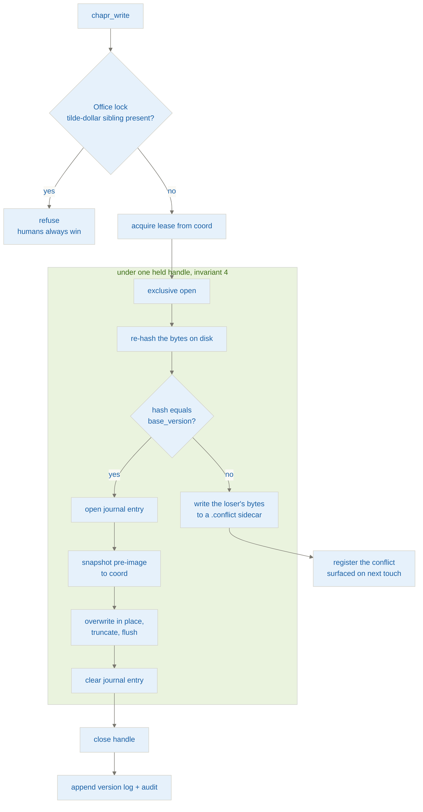
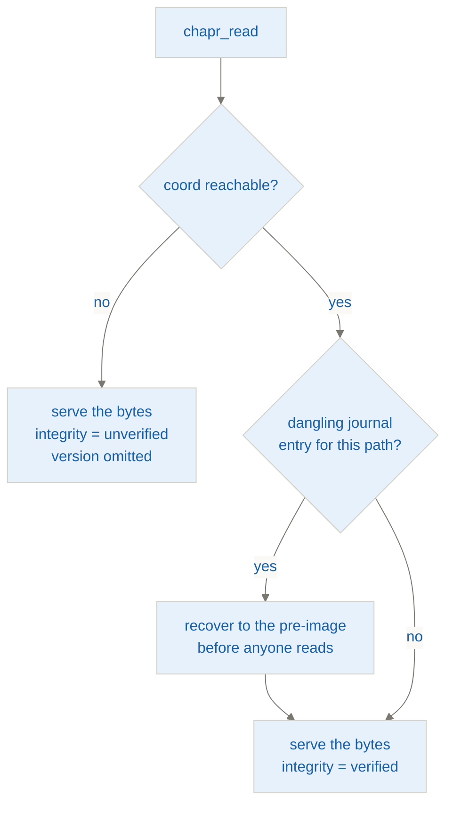

# Architecture

The depth behind [the README](../README.md). Read that first for what Chaperone is
and how to install it; read this before changing how it works.

- [The two artifacts](#the-two-artifacts)
- [Load-bearing invariants](#load-bearing-invariants)
- [The write path](#the-write-path)
- [The read path](#the-read-path)
- [Failure directions](#failure-directions)
- [Read limits, and what a model can write back](#read-limits-and-what-a-model-can-write-back)
- [Layout](#layout)
- [Backends](#backends)

## The two artifacts

Two deployables, N-to-1:

- **`chapr-endpoint`**: one per user machine, run as a stdio child of an MCP host
  (Claude Desktop, the Claude Code CLI, or any other MCP client). Does file I/O
  **as the logged-in user** (Kerberos on SMB), and owns the exclusive-open write
  path, the CAS check, the in-place write, the lease-renewal thread, and the read
  state machine.
- **`chapr-coord`**: exactly one, on-prem beside the fileserver. Stateful. Owns
  the lease table, version index, intent journal, history/blob store, conflict
  registry, audit log, and the change-watcher. Does **no file I/O of its own**.

Auth is a pluggable boundary, because the deployment posture varies: some sites
have on-prem AD, some are cloud-managed with a NAS and no Kerberos realm at all.
The default is `shared-secret`: one token per deployment admits a caller to the
control channel, and the logged-in OS identity is still derived automatically, so
the user still sets nothing beyond the coordinator's URL and token. Negotiate and
OIDC are the hardening paths that make the acting identity *verified* rather than
asserted; `trusted-header` remains for a network where authenticating nothing is
already acceptable.

## Load-bearing invariants

> [!IMPORTANT]
> These are assertions, not preferences. Getting them backwards loses data.

1. **Ground truth is on the share, never in coord.** Coord caches; every write
   re-derives the version from the file *under the lock* before trusting anything
   coord said.
2. **Version token = content hash.** `version = BLAKE3(file_bytes)`. One hash
   serves as CAS change-detector, history store key, and audit chain link.
3. **Exclusive-open + CAS is the correctness core; leases are only an
   optimization.** Correct with lock+CAS and no leases. *Not* correct with leases
   and no CAS. Never invert this.
4. **Version-check and write share one file handle.** Hash-then-reopen-to-write is
   a TOCTOU race. Everything from version-check to write-close happens under one
   held exclusive handle.
5. **All coordination state is keyed by canonical path** (DFS-resolved, NFC,
   casefolded, UNC, normalized separators). Two users naming a file differently
   must map to the same lease.
6. **File bytes reach the model directly; coord sees bytes only for history.** The
   200 MiB PDF a model reads never goes through coord: endpoint → share → model. A
   write *does* send the file's previous contents to coord (`PUT /blobs`), because
   that pre-image snapshot is what history and crash recovery are made of. That is
   the only byte flow on the control channel, it is one direction, and it is
   bounded explicitly by `http::MAX_BLOB_BYTES` (256 MiB). Both ends buffer whole,
   so that bound is also coord's per-in-flight-write memory cost, and the largest
   file Chaperone can write at all, since a write whose pre-image will not fit is
   refused up front. The bound is stated on the *route* as well as on the types: an
   invariant enforced on type shape alone let an unsized raw-body channel exist
   unnoticed.

The deliberate failure directions that follow from these are tabulated under
[Failure directions](#failure-directions) below.

## The write path

This is the one place where a subtle mistake costs someone their data. It is
intentionally the most boring, linear, synchronous-looking code in the repo, and
should stay that way. Writes are in-place, never temp-then-rename, because a rename
carries the source ACL and strips the target's ACEs. Crash safety comes from the
journal plus the snapshot, not from an atomic rename.

The ordering *is* the correctness. Everything inside the dashed box happens under
one held exclusive handle, in straight-line blocking I/O inside `spawn_blocking`:

Two refusals rather than one failure mode: an Office lock file means a human has
the document open, and a CAS mismatch means somebody else wrote first. Neither
loses bytes: the lock case never opens, and the conflict case parks the loser's
content in a sidecar and registers it.

## The read path

Reads mutate nothing and are the core capability, so they degrade rather than
refuse, the opposite direction from writes:

A reader never sees torn bytes, and a coordinator outage never stops a read.

## Failure directions

Every one of these is a deliberate choice of which way to fail, not a fallback that
happened.

| Situation | Direction | Why |
| --- | --- | --- |
| Coord unreachable, **write** | **Fail closed**, refuse | Writes are rare; refusing costs a retry, guessing costs data |
| Coord unreachable, **read** | **Degrade open**: serve with `integrity = "unverified"`, version omitted | Reads mutate nothing and are the core capability |
| Torn file (dangling journal) on read | **Recover, then serve** the pre-image | A reader must never see torn bytes |
| CAS conflict | Loser's bytes to a `.conflict-{user}-{ts}` sidecar, registered, surfaced on next touch | Never lose either party's bytes; never fake-merge an Office binary |
| Office lock (`~$F`) present | **Refuse the write** | Humans always win. Leases are advisory with respect to Excel |
| Retry storm | Bounded retries, exponential backoff + jitter, per-file budget, terminal "ask the human" state | An LLM will otherwise retry forever |

## Read limits, and what a model can write back

Two independent limits, deliberately not one number:

- **`DEFAULT_MAX_INLINE_BYTES`** (1 MiB, override with `CHAPR_MAX_INLINE_BYTES`)
  is a *context* limit: how much of a file usefully enters the model's input
  window. Over it, the read is refused rather than truncated: a silently shortened
  body written back destroys the file's tail. The refusal is a **tool-level**
  result, not a protocol error, and it says what the caller can do instead.
  Raising the cap is an operator action on that machine, so it is phrased as
  something to pass on rather than something to attempt.
- **`WRITEBACK_BUDGET_BYTES`** (128 KiB) is what a model can realistically echo
  back through `chapr_write` in one call. It refuses nothing; it reports
  `writable_inline=` in the envelope header, so a body too large to write back is
  still served for analysis while the model is told in-band to put its output in a
  separate, smaller file.

Collapsing these into a single cap makes reads as restrictive as writes, which is
backwards here: the share is read-heavy over large materials and writes go into
smaller, *different* derived artifacts.

**Binary content is refused, not silently base64-encoded.** A PDF, Office
document, image or archive is identified by **magic bytes, never by extension**,
because the share contains misnamed files, and is refused as a tool-level result
naming what to read instead. Handing those bytes over was an active footgun rather
than a passive limitation: base64 is not analysable, and a model given it does not
reliably refuse: it recognises the container header and confabulates, producing a
confident summary of a document nobody read, written back into a coordinated file
under the user's own AD principal.

Format is judged **independently of UTF-8 validity**, because those are not the
same test: an uncompressed PDF can be entirely ASCII and would otherwise be served
as "text".

**A text file in an encoding other than UTF-8 is also refused — and is told apart
from a binary one.** Chaperone reads text as UTF-8 and deliberately does not
convert encodings: the write side can only emit UTF-8, so transcoding on read
would mean a verbatim echo silently rewriting the file in a different encoding and
recording it as a deliberate edit under the user's own principal. For files where
the encoding is a requirement rather than an accident — a `.bat` that `cmd.exe`
reads as OEM, a `.ps1` that PowerShell 5.1 reads with a BOM — that would break the
file's own function.

So these refuse too, but they are a **different refusal with a different message**.
A Windows-1252 Danish `.txt` or a UTF-16 file from PowerShell is not a binary and
must never be described as one: the refusal names the encoding it found, says
plainly that nothing is wrong with the file or the share, and gives the human
remedy (re-save as UTF-8, or fix the export step that produces it). Calling that
file "an unrecognised binary … worth their attention" made agents raise phantom
findings with users about their own routine documents (I-015).

The refusal also **files a `NON_UTF8_TEXT` diagnostic** (`Severity::Warning`) with
the structural evidence — likely encoding, BOM, offset of the first invalid byte,
share of high bytes — so the diagnosis reaches whoever administers the share
through the channel built for it, grouped per file, instead of depending on an
agent to relay it. Container refusals file nothing: a PDF on a shared drive is a
designed outcome, and recording every one would bury the entries that need action.
The classifier that separates the two cases chooses **only which message to
print** — never whether to serve — which is what keeps its thresholds harmless.

Byte-exact round-trips are still available, and still safe, behind an explicit
`allow_binary` on the read. The legitimate use is *copying* a file, not reading
it. With it set, the body comes back base64 with `encoding=base64` in the envelope
exactly as before.

There is still no text extraction, and reading tender PDFs *as documents* is not
something `chapr_read` delivers. `ReadContent::Ref` is defined in the proto for
this and is not yet produced anywhere. Chaperone coordinates the files; getting a
PDF's text in front of a model is a separate problem.

In practice it is solved **upstream**: the workflow extracts each PDF, spreadsheet
and document to a text mirror first, and the model reads those. That is why the
inline cap is sized for one extracted document rather than for a source PDF, and
why the cap, not the base64 path, is the limit that actually matters day to day.

## Layout

A Cargo workspace of three crates, built in this order:

| Crate | Role |
| --- | --- |
| `crates/chapr-proto` | Shared wire contract: records, IDs, version token, the `chapr.*` request/response types, and an exhaustive error enum. Both binaries import it, so neither can drift. |
| `crates/chapr-coord` | Coordination service. `axum` + `sqlx`/SQLite, background jobs (lease reaping, journal sweep, blob GC), setup wizard, native service install. No Windows-specific primitives in the core. |
| `crates/chapr-endpoint` | Local MCP server. `rmcp` over stdio, pluggable filesystem backends, lease-renewal thread, read state machine. |

Also here: `packaging/` (MCPB bundle builder for the endpoint, coord config
template and service install notes) and [`deployment-guide.md`](deployment-guide.md).

Chaperone is the reusable engine. Customer-specific deployables, which commit
built binaries, live in their own repos.

## Backends

The endpoint selects a backend at runtime (`CHAPR_BACKEND`), against a shared
write-path core:

- **`smb`**: Windows. `CreateFileW` with `FILE_SHARE_NONE` for the exclusive
  open, `ReadDirectoryChangesW` for the watcher.
- **`posix`**: Linux and macOS. Advisory `flock`.

> [!NOTE]
> The two are not equivalent, and the adapter declares that rather than hiding it.
> SMB's lock is **mandatory**: it excludes non-Chaperone writers too, which is why
> invariant 3 holds against Excel. POSIX `flock` is **advisory**: it coordinates
> Chaperone sessions with each other and cannot stop an unrelated process.

The long-term direction is that coord *announces* what the environment is and
endpoints confirm it against their own local capabilities, selecting a matching
backend. Local knowledge is authoritative.
